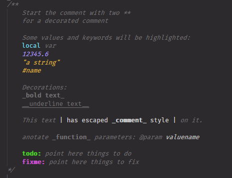

# MaxScript language support

Autodesk 3ds Max Scripting language (MaxScript) support.

**This project is no longer maintained, please follow the new version at: https://github.com/HAG87/vscode-maxscript-lsp**

## Features

- Syntax highlight.
- Semantic syntax highlight
- Code autocompletion for keywords, primitives, generic functions, structs, interfaces and classes.
- Go to Symbol in document (Basic support, somewhat buggy).
- Go to Definition and peek definition in document.
- Snippets for most used code blocks.
- Help command (*MaxScript help. Accessible from the right-click menu.*): Select a keyword and open related online documentation.


## Release Notes

[Changelog](./CHANGELOG.md)

## Requirements

None.

## Extension Settings

```json
  "maxscript.completions": true | false,
  "maxscript.gotosymbol": true | false,
  "maxscript.gotodefinition": true | false,
  "maxscript.semantics": true | false,
  "maxscript.helpprovider": string,
```

## Syntax Highlight inside comments



## Syntax Highlight

Suggested settings for **Custom highlighting**. List of available scopes [here](./TextMate-scopes.md)

```json
  /*
  * Syntax highlight options for language maxscript
  */
  "editor.tokenColorCustomizations": {
    "textMateRules": [
      // Extras
      {
        "name": "Todo",
        "scope": "documentation.todo.mxs",
        "settings": { "foreground": "#4bd621", "fontStyle": "bold" }
      },
      {
        "name": "Fixme",
        "scope": "documentation.fixme.mxs",
        "settings": { "foreground": "#ce55d3", "fontStyle": "bold" }
      },
      {
        "name": "Plain text",
        "scope": "documentation.plain.mxs",
        "settings": { "foreground": "#cecece", "fontStyle": ""}
      },
      // Characters
      {
        "name": "Linebreak",
        "scope": "keyword.operator.linebreak.mxs",
        "settings": { "foreground": "#6d6d6d", "fontStyle": "bold" }
      },
      {
        "name": "byReference keyword",
        "scope": "keyword.operator.byref.mxs",
        "settings": { "foreground": "#78C28E", "fontStyle": "italic" }
      },
      // Values
      // {
      //   "name": "Name values",
      //   "scope": "string.unquoted.name.mxs",
      //   "settings": { "foreground": "#c678dd" }
      // },
      {
        "name": "Verbatim string",
        "scope": "string.quoted.double.verbatim.mxs",
        "settings": { "fontStyle": "italic" }
      },
      {
        "name": "Localized resources",
        "scope": "string.quoted.other.mxs",
        "settings": { "foreground": "#8f724a" }
      },
      // Misc
      {
        "name": "Properties",
        "scope": "variable.property.mxs",
        "settings": { "foreground": "#ce9b3d", }
      },
     {
        "name": "Event target",
        "scope": "entity.target",
        "settings": { "foreground": "#E6B52E", "fontStyle": "italic" }
      },
      // Variables
      {
        "name": "Path names",
        "scope": "variable.other.pathname.mxs",
        "settings": { "foreground": "#7A9F4D" }
      },
      // Declaration
      {
        "name": "Declaration",
        "scope": "storage.type.mxs",
        "settings": { "fontStyle": "" }
      },
      // Keywords
      {
        "name": "mxs keyword operator",
        "scope": "keyword.operator.mxs, keyword.operator.word.mxs",
        "settings": { "foreground": "#78BEC2" }
      },
      {
        "name": "Keyword other",
        "scope": "keyword.other.mxs",
        "settings": { "foreground": "#78C28E" }
      },
      {
        "name": "mxs constant",
        "scope": "constant.language, variable.language.mxs",
        "settings": { "foreground": "#528BFF" }
      },
      // Types
      {
        "name": "mxs array",
        "scope": "storage.type.array.mxs, storage.type.bitarray.mxs",
        "settings": { "foreground": "#E5CB82", "fontStyle": "" }
      },
      // support
      {
        "name": "Types",
        "scope": "support.type.primitive.mxs",
        "settings": { "foreground": "#477FB0" }
      },
      {
        "name": "Objectset",
        "scope": "support.variable.objectset.mxs",
        "settings": { "foreground": "#E6B52E" }
      },
      {
        "name": "Interfaces",
        "scope": "support.type.interface.mxs",
        "settings": { "foreground": "#759FD1" }
      },
      {
        "name": "Class",
        "scope": "support.class.mxs",
        "settings": { "foreground": "#A875D1" }
      },
      {
        "name": "Structs",
        "scope": "storage.type.struct.mxs",
        "settings": { "foreground": "#7b6ccd" }
      },
      {
        "name": "Constant",
        "scope": "support.constant.mxs",
        "settings": { "foreground": "#c56038" }
      },
      {
        "name": "Superclass",
        "scope": "support.superclass.mxs",
        "settings": { "foreground": "#6c7bcd" }
      },
      {
        "name": "Variables",
        "scope": "support.variable.system.mxs",
        "settings": { "foreground": "#cda06c" }
      },
    ]
  },
```

## Executing MaxScript

MXSPyCOM project allow for editing & execution of 3ds Max MaxScript and Python files from external code editors.

- Get it here: [MXSPyCOM by Jeff Hannna](https://github.com/JeffHanna/MXSPyCOM)
- Follow the configuration guide to register the COM server.
- Set up a vscode task:

```json
{
    "version": "2.0.0",
    "tasks": [
      {
        "label": "MXSPyCOM execute Script",
        "type": "shell",
        // Add MXSPyCOM.exe to PATH or use file root, i.e: "C:/MXSPyCOM/MXSPyCOM.exe"
        "command":".\\MXSPyCOM.exe",
        "args": [
            "-s",
            { "value": "${file}", "quoting": "strong" }
        ],
        "group": "test",
        "presentation": {
            "echo": true,
            "reveal": "silent",
            "focus": false,
            "panel": "shared"
        }
    }
  ]
}
```

- run the task, enjoy the 3ds max listener catching errors.

## Contribute

[gitHub](https://github.com/HAG87/vscode-maxscript)

>Note: MaxScript Structure is to say at least, chaotic. I've done my best to organize structs, classes, interfaces and so on. However the grammar is usable enough.
