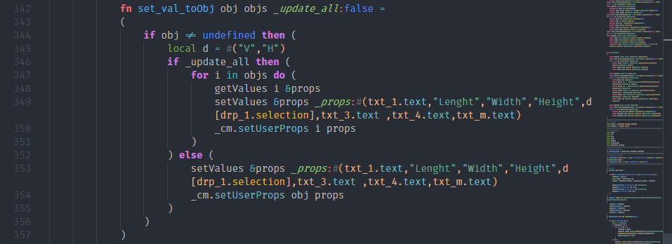
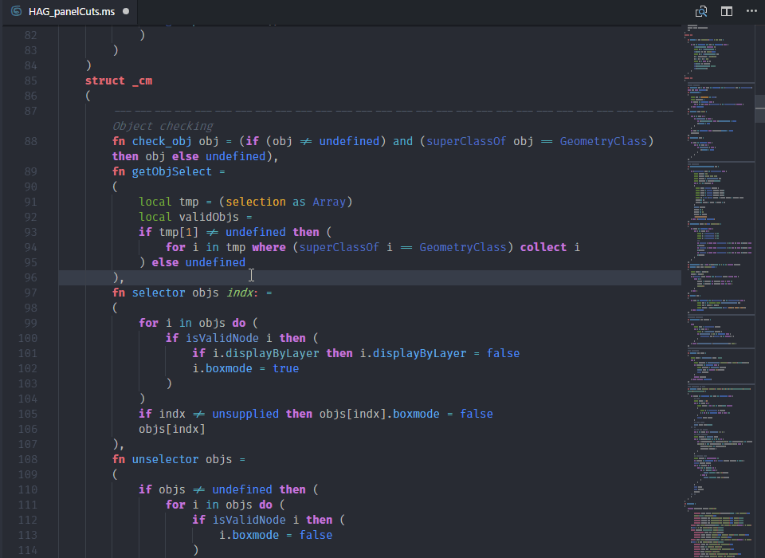

# MaxScript language support

Autodesk 3ds Max Scripting language (MaxScript) support.

## Features

- Syntax highlight.
- Code autocompletion; for keywords, primitives, generic functions, structDefs, interfaces and classes.
- Snippets for most used code blocks.
- Customized theme to match MaxScript elements diversity.
- Help command (*MaxScript help. Accessible from the right-click menu.*): Select a keyword and open related online documentation.






## Requirements

None.

## Extension Settings

None yet.

## Executing MaxScript

MXSPyCOM project allow for editing & execution of 3ds Max MaxScript and Python files from external code editors.

- Get it here: [MXSPyCOM by Jeff Hannna](https://github.com/JeffHanna/MXSPyCOM)
- Follow the configuration guide to register the COM server.
- Set up a vscode task:

```json
{
    "version": "0.1.0",
    "command": "C:/MXSPyCOM/MXSPyCOM.exe",
    "isShellCommand": false,
    "args": ["-f"],
    "showOutput": "always",
    "tasks": [
        {
         "taskName": "Execute in Max",
         "args": ["${file}"],
         "suppressTaskName": true
        }
    ]
}
```

- run the task, enjoy the 3ds max listener throwing errors.

## Release Notes

[Changelog](./CHANGELOG.md)

Initial release.

## Contribute

[gitHub](https://github.com/HAG87/vscode-maxscript)

>Note: MaxScript Structure is to say at least, chaotic. I've done my best to organize structs, classes, interfaces and so on. However the grammar is usable enough.